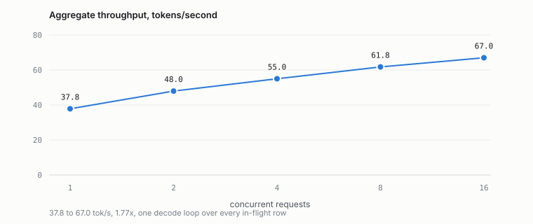
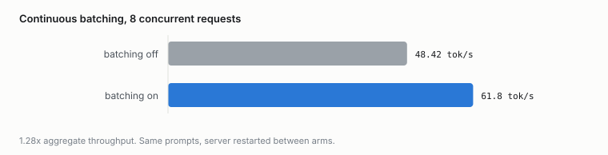
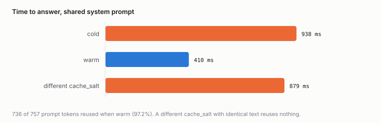

# Continuous-batching serving features: what is here, read against the code

Audited 2026-09-23 against `1c89868`. Every row carries the file and
line that decides it, because the last two audits of this kind found
prose describing a leak that had been fixed and a refusal called an
absence. A capability table nothing checks is a claim, not an audit.

The reference design is the one the high-throughput serving engines
converged on: one decode loop over every in-flight sequence, KV in
fixed-size pages with a block table, a prefix tree over those pages,
and an admission policy that reads the tree. Each section below says
what frink does, where, and what it does not do.

## Continuous batching

**Implemented.** `crates/frink-server/src/serving/batch/worker.rs:1`
states the loop: *drain, admit, apply cancellations, run one prefill
chunk and one batched decode step, then flush whatever finished.* A
request that arrives mid-generation is admitted on the next tick and
joins the same decode step as the rows already running; it does not
wait for them to finish.

- Admission: `worker.rs:62` (`admit`), capped by both a sequence count
  and a block budget (`block_budget.rs`). A head job that does not fit
  stops the line rather than being skipped, because skipping on SIZE
  is a starvation bug.
- One row's state is a value (`row.rs`, `Slot`), so rows are added and
  removed without a second code path.
- Per-row timing is owned by one type (`clock.rs`), which is why
  `usage` cannot be built without its rates or its prefix reuse.

**Measured**, 2026-09-23, M2 Pro, Llama-3.2-1B Q4_K_M, two interleaved
passes: 37.8 tok/s at concurrency 1 rising to 67.0 at 16, and 48.4
against 61.8 tok/s with batching off and on at concurrency 8. Passes
agreed within 1.2%.

<picture>
  <source media="(prefers-color-scheme: dark)" srcset="../assets/serving-scaling-dark.svg">
  
</picture>

<picture>
  <source media="(prefers-color-scheme: dark)" srcset="../assets/serving-batching-dark.svg">
  
</picture>

**Not implemented:** preemption. A running row is never evicted to
make room for a waiting one; admission refuses instead and the request
queues. `serving/mod.rs:11` records why the scheduling quantum is a
chunk duration, which is the related half.

### The per-step token budget

A tick runs one prefill chunk and then one decode step over every
in-flight row. The chunk was a CONSTANT and the decode step is
`rows.len()` tokens wide, so a tick cost `chunk + rows`, growing with
the batch, and nothing bounded the pair.

That cost lands on the wrong request: every decoding row waits out the
whole prefill chunk before its next token, so admitting one prompt
raises inter-token latency for everybody already answering, and the
more rows are decoding the more waiting the same chunk causes. The
knob that bounds it cannot exist while prefill and decode are budgeted
separately, because the quantity to bound is their SUM.

The high-throughput serving engines answer this with one budget per
step, spent by prompt tokens and generated tokens alike, with no phase
distinction. `serving/batch/step_budget.rs` is that at this worker's
shape: the decode width is known before the prefill chunk runs, so the
chunk takes what is left of `max_batch_tokens`
(`step_budget.rs:55`, `FRINK_CB_MAX_BATCH_TOKENS`) rather than a fixed
number.

Two properties, both tested rather than argued:

- **It can only take work away.** The configured `prefill_chunk` stays
  the ceiling, so a server tuned by that knob keeps its meaning, and a
  tick never costs more than it did before.
- **It cannot deadlock.** A budget alone does: once enough rows are
  decoding the remainder is zero, no prompt advances, and the rows that
  would free the budget wait on a prompt that never runs.
  `MIN_PREFILL_CHUNK` (`step_budget.rs:63`) is the floor, driven to
  completion by `a_saturated_batch_still_advances_its_prompts` rather
  than read off the constant.

The floor means the budget is a TARGET and not a cap: a batch wider
than the budget still costs `rows + MIN_PREFILL_CHUNK`. Bounding it
strictly would mean preempting a decoding row, which this engine does
not do.

**The first version of the test asserted the wrong property.** It said
per-tick work was FLAT, and it is not: at a narrow batch the
configured chunk binds rather than the budget, so a tick costs
`rows + chunk` there and `max_batch_tokens` once the budget starts
binding. The test failed and the claim was wrong, which is the same
lesson `cache_aware`'s "reordering alone saves nothing" already
carries.

## Paged KV

**Implemented.** `crates/frink-core/src/cache.rs` is the store:
`block_size` positions per block over a shared budget of blocks
(`cache.rs:48`, `cache.rs:57`), handed out as `PageGroup`s. A sequence holds a
lease, not a contiguous buffer, so its KV is scattered and its pages
are returned when it ends.

- Copy-on-write fork: `generate.rs:415`. A fork shares whole page
  groups and copies only the part-written tail. It REFUSES on a
  sliding-window model (`ForkRefused::SlidingWindow`), because two
  sequences recycling out of one page set is a use-after-free that
  reads as another position's tokens.
- Chunked prefill: `serving/batch/prefill.rs:158`, with a test pinning
  that chunking does not change the logits.
- Quantized KV wires: `f16`, `q8_0`, `fp8`, `q4`, the last with a
  Hadamard rotation on K.

**Not implemented:** swapping pages to host memory under pressure. The
pool is reclaimed from the prefix tree (below) or the request waits.

## Prefix caching over paged KV

**Implemented.** `crates/frink-server/src/policy/radix/` is a radix
tree over page indices: `match_prefix` (`plain.rs:201`) and
`insert_prefix` (`plain.rs:211`); `lock` (`plain.rs:245`) and `unlock`
(`plain.rs:259`), so a prefix a live lease adopted cannot be taken
from under it; and `evict` (`plain.rs:287`), taking the least recently
matched unlocked leaf and cascading into a newly childless parent.

- Namespaces: `salted.rs` is one tree per caller salt over one page
  pool, with round-robin eviction across namespaces. Two callers with
  byte-identical prompts share nothing.
- Reclamation is wired on both decode paths: `generate.rs:857` calls
  `evict` from `acquire_paged_caches`, which the private loop and the
  batched worker both go through, and the caller retries immediately
  rather than charging reclamation against its deadline.

**Measured**, same conditions: a 757-token shared system prompt is
reused 736 of 757 tokens deep (97.2%), 938 ms cold against 410 ms
warm. A
different salt with identical prompt text reuses nothing. Reported
through `usage.cached_tokens` on both paths since 0.49.0 — before
that the batched path adopted correctly and reported zero, which is
what the measurement found.

<picture>
  <source media="(prefers-color-scheme: dark)" srcset="../assets/serving-prefix-dark.svg">
  
</picture>

**Reproduce:** `frink serve-bench --shared-prefix 4000 --requests 32`.

Every number above comes from
[`benchmarks/receipts/serving/serving_features_m2pro_0.49.0.json`](../../benchmarks/receipts/serving/serving_features_m2pro_0.49.0.json),
which the charts are generated from and which
`documented_serving.rs` checks this prose against. A chart drawn from
numbers typed in beside it is two structures that must agree with
nothing enforcing it.

## Cache-aware admission

**Implemented.** `serving/batch/cache_aware.rs`. When a prefix tree is
configured, admission ranks the first `WINDOW = 8` waiting jobs by how
much of each prompt the tree already holds and admits the deepest.

Two hard bounds make starvation impossible rather than unlikely: only
the first eight are considered, and no job may be passed over more
than `MAX_SKIPS = 4` times, after which nothing overtakes it and the
scan stops at it. `a_job_cannot_be_passed_over_forever` drives the
queue rather than reading the constant.

The peek is read-only (`plain.rs:176`, `peek_cached_len`), so ranking
a job that is not admitted neither splits a node nor stamps the LRU
clock: asking through the ordinary lookup would make recency reflect
what was considered rather than what was served.

**Not measured end to end.** With cache depths held fixed a reordering
saves nothing, and a test says so because the first draft asserted a
saving the arithmetic did not support. The saving is under page
pressure, where a cached prefix is lost by waiting: 3000 prefill
tokens against 1200 on the modelled three-job case. **That is a unit
test with an eviction model in it, not a server reading**, and it is
the one number in this document that did not come off a socket.

## What is not here

| | |
|---|---|
| Preemption / row eviction | Not implemented. Admission refuses; the request queues. |
| KV swap to host | Not implemented. Pages come back from the tree or the request waits. |
| Tensor / pipeline parallel | Not implemented. Single process, single device. |
| Disaggregated prefill | Not implemented. |
| Multi-device expert residency | Policy only. `frink-core`'s expert-residency stack decides and nothing executes it except a compile-only CUDA pool whose hardware test is `#[ignore]`d. |

Present and worth naming because they are usually listed beside the
above: speculative decoding with a draft model (`--model-draft`),
grammar- and schema-constrained decoding, LoRA adapters
(`frink-models/src/lora.rs`), and an OpenAI- plus Anthropic-compatible
API surface.

## Throughput against another engine

**Not measured, deliberately.** Cross-engine numbers need a quiet box.
The CPU and CUDA rows in `benchmarks/RESULTS.md` come from rented
hardware and every one of them is currently marked stale against this
build. Metal is the one backend this laptop is the sanctioned hardware
for, and at the time of this audit `suggestd` and `spotlightknowledged`
were each holding about 90% of a core, which `CLAUDE.md` names as
disqualifying. A number taken then would be a fact about the desktop
session.

The serving figures above are self-relative — one build against itself
on one box, interleaved — which is exactly the kind of measurement a
loaded machine can still support, and is why they are quoted and a
throughput comparison is not.
